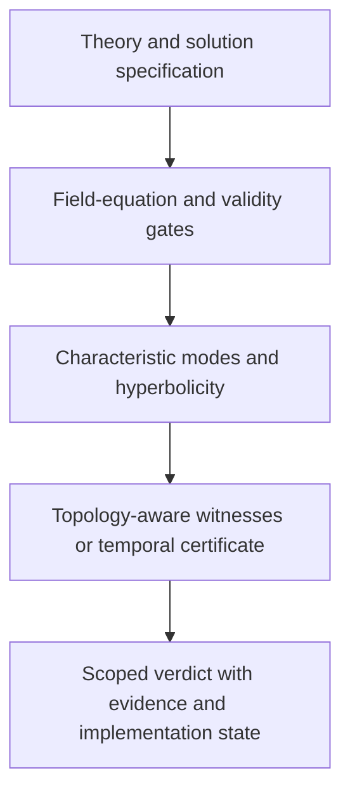

# Architecture

CTC-FA v2.1 is a refusal-first scientific pipeline. A verdict is emitted only
after the data contract, domain, field equations, characteristic structure and
topology needed for that verdict have been checked.

## Two executable distributions

### `ctcfa`: recovered and rerun v2.0 baseline

The baseline contains the 33-model registry and the full computational layer
described in the v2.0 standard. Its principal modules are:

| Layer | Responsibility | Main modules |
|---|---|---|
| L0-L3 | registry, contracts, coordinates, signatures, quotient topology | `model`, `registry`, `validate`, `topology` |
| L4-L7 | Killing fields, compact/deck orbits, loop search, temporal certificates | `symmetry`, `causality`, `quotient_ctc`, `loops` |
| L8-L11 | horizons, curvature, energy conditions, geodesics | `horizons`, `symbolic`, `numgeom`, `energy`, `geodesics` |
| L12-L15 | ADM constraints, QFT assumptions and theorem applicability | `adm`, `qft`, `theorems` |
| L16-L19 | continuation, minimal perturbation, accessibility and meta-analysis | `continuation`, `perturbation`, `optimize`, `meta` |
| Evidence | scoped verdicts, provenance, immutable run records and reports | `status`, `provenance`, `report` |

### `ctcfa_v21_ref`: verified v2.1 theory-aware core

| Gate | Question | Failure state |
|---|---|---|
| T0 | Do the theory, fields, solution, conventions and provenance agree? | `INVALID_SPEC` |
| T1 | Is the solution on shell and inside its declared EFT/approximation regime? | `OFF_SHELL` or `OUTSIDE_EFT` |
| T2 | Is the full physical characteristic bundle present, Lorentzian and hyperbolic? | `NOT_IMPLEMENTED` or `ILL_POSED` |
| T3 | Is there a topology-aware CTC witness or a common temporal certificate for every physical cone? | `CTC_PROVED`, `ALL_CONES_CAUSAL_CERTIFIED`, or `UNRESOLVED` |

The reference core is intentionally small. It supplies constant-background
Minkowski and quadratic k-essence analytic controls, not rotating k-essence,
EdGB or generic Horndeski background solvers.

## Claim asymmetry

One valid positive witness can support an existential statement: a declared
solution sector admits a CTC. Failure to find a witness cannot establish global
absence. A negative result is promoted only when a single-valued temporal
function is timelike for every physical characteristic cone on the entire
declared domain.

No solution-level negative verdict can be converted into a theory-wide claim.
A positive verdict may widen only to the existential statement that the theory
admits at least one qualifying solution.

